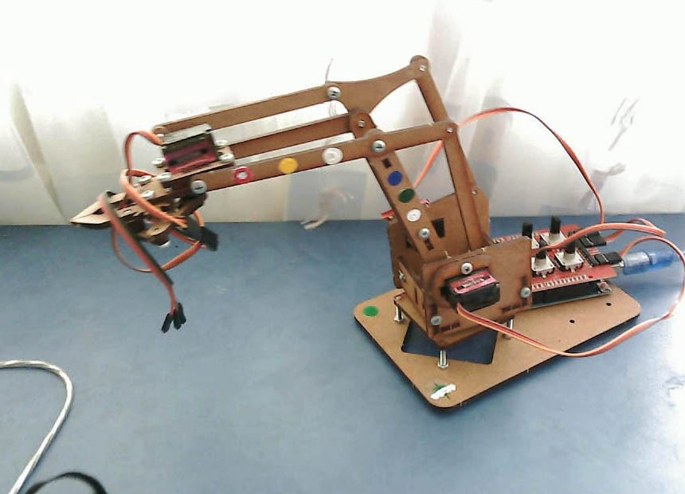

# Feeding Robot

> I started this project when I had very little experience in ML. I didn't know much and made a number of silly mistakes. The project provided me with a lot of experience and insights that helped me in other tasks. This project has been dormant for a while, and I am unlikely to continue working on this specific code. However, I am determined to implement the project someday. Please also note that this is a rough translation into English.
> [Video](https://www.youtube.com/watch?v=qfuOcrQkL3o)

Main project motivation:

> Many people suffer from various musculoskeletal disorders that make independent feeding problematic or impossible. The need for assistance in this process creates many associated problems and can negatively impact a person's mental health.
>
> Existing solutions are often inaccessible, cumbersome, or difficult to operate. On the other hand, simple robotic manipulators and web cameras are relatively affordable and compact, so it was decided to create software for them.
>
> Ideally, the solution should be relatively easy to calibrate for a wide range of budget-friendly web cameras and Arduino-based manipulators. A calibration step for the system before the feeding process is acceptable. The installation and calibration of the system should be straightforward and not require special skills.

To begin the project, a robotic manipulator and a webcam were purchased. This manipulator is not suitable for real operation and will be replaced later, but it will suffice for testing purposes.

To simplify the recognition process, 8 markers were placed on the robot.

Approximate development plan:

- Basic marker recognition.
- Reconstruction of the robot's position in space.
- Basic control of the robot. Moving the manipulator to a specified point in space.
- Mouth recognition.
- Recognition and reconstruction of the robot's surroundings, searching for plates and obstacles.
